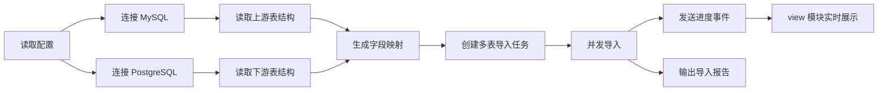
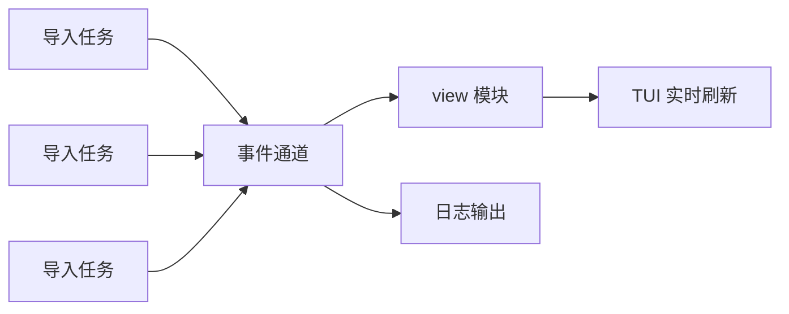

# 夹心饼干

夹心饼干是一个用于把 MySQL 数据导入 PostgreSQL 的数据迁移工具。MySQL 作为上游数据源，PostgreSQL 作为下游目标库。两边的库和表默认已经提前创建好，工具只负责按配置读取、转换和写入数据。

## 目标

- 支持从 MySQL 导入数据到 PostgreSQL。
- 支持指定要导入的 MySQL 表。
- 默认认为上下游表名一致、字段名一致。
- 支持为不同表配置自定义数据转换规则。
- 能处理上游字段缺失的情况，避免因为个别字段不存在导致整批任务不可控失败。
- 支持多个表并发导入，并通过 TUI 实时展示每个表的导入进度。
- 导入过程可重复执行，尽量做到结果可预期、问题可定位。

## 不做什么

- 不负责自动创建 MySQL 或 PostgreSQL 的库、表、索引。
- 不负责自动修改 PostgreSQL 表结构。
- 不作为实时同步工具，优先定位为批量导入工具。
- 不默认删除 PostgreSQL 中已有数据，是否清理或覆盖由配置明确决定。

## 基本流程

1. 读取任务配置。
2. 连接 MySQL 和 PostgreSQL。
3. 校验要导入的表是否存在。
4. 读取 MySQL 表字段和 PostgreSQL 表字段。
5. 根据配置生成字段映射关系。
6. 为每个待导入表创建导入任务。
7. 多个表按配置并发执行导入。
8. 每个导入任务分批从 MySQL 读取数据。
9. 对每行数据执行字段映射、默认值填充和自定义转换。
10. 分批写入 PostgreSQL。
11. 导入过程中持续发送进度事件到 view 模块。
12. view 模块通过 TUI 实时展示整体进度和每个表的进度。
13. 输出导入结果，包括成功数量、失败数量、跳过数量和错误原因。



## 配置设计

配置应至少包含三部分：上游连接、下游连接、导入任务。

示例：

```yaml
mysql:
  host: 127.0.0.1
  port: 3306
  database: source_db
  username: root
  password: password

postgresql:
  host: 127.0.0.1
  port: 5432
  database: target_db
  schema: public
  username: postgres
  password: password

job:
  batchSize: 1000
  concurrency: 4
  onMissingSourceColumn: useDefault
  onWriteConflict: fail
  debug: false
  countTotalRows: false
  view:
    enabled: true
    type: tui
    refreshIntervalMs: 200
  tables:
    - sourceTable: user
      targetTable: user
      columns:
        - source: id
          target: id
        - source: name
          target: name
        - source: age
          target: age
          defaultValue: 0
        - source: created_at
          target: created_at
          transform: mysqlDatetimeToPgTimestamp
```

### 执行配置

| 配置项 | 是否必填 | 说明 |
| --- | --- | --- |
| `batchSize` | 否 | 每批读取和写入的数据量，默认 `1000` |
| `concurrency` | 否 | 同时导入的表数量，默认 `1` |
| `onMissingSourceColumn` | 否 | 上游字段缺失时的默认处理策略 |
| `onWriteConflict` | 否 | 写入 PostgreSQL 时遇到冲突的处理策略 |
| `debug` | 否 | 是否在 TUI 中显示 MySQL 查询和 PostgreSQL 操作，默认关闭 |
| `countTotalRows` | 否 | 是否在导入前统计总行数，默认关闭，避免大表 `count(*)` 卡住 |
| `view.enabled` | 否 | 是否开启实时进度展示，默认开启 |
| `view.type` | 否 | 展示方式，第一阶段使用 `tui` |
| `view.refreshIntervalMs` | 否 | 界面刷新间隔，默认 `200` 毫秒 |

### 表配置

每个导入表支持以下配置：

| 配置项 | 是否必填 | 说明 |
| --- | --- | --- |
| `sourceTable` | 是 | MySQL 表名 |
| `targetTable` | 否 | PostgreSQL 表名，不填时默认等于 `sourceTable` |
| `where` | 否 | MySQL 查询过滤条件，用于只导入部分数据 |
| `orderBy` | 否 | 分批读取时的排序字段，建议使用主键或稳定递增字段 |
| `columns` | 否 | 字段映射配置，不填时默认按同名字段导入 |

### 字段配置

每个字段支持以下配置：

| 配置项 | 是否必填 | 说明 |
| --- | --- | --- |
| `source` | 否 | MySQL 字段名 |
| `target` | 是 | PostgreSQL 字段名 |
| `defaultValue` | 否 | 当上游字段缺失或值为空时使用的默认值 |
| `required` | 否 | 是否必须存在且必须有值，默认 `false` |
| `transform` | 否 | 自定义转换规则名称 |
| `skipIfMissing` | 否 | 上游字段缺失时是否跳过该字段，默认 `false` |

## 默认映射规则

在未配置 `columns` 时，工具按以下规则处理：

- 读取 PostgreSQL 目标表字段列表。
- 在 MySQL 源表中查找同名字段。
- 同名字段存在时，直接导入。
- 同名字段不存在时，按“上游字段缺失规则”处理。

这样可以满足“大多数表名、字段名都相同”的场景，同时允许个别表单独定制。

## 上游字段缺失规则

上游字段缺失是重点场景。建议提供全局策略和字段级策略，字段级策略优先级更高。

### 可选策略

| 策略 | 说明 | 适用场景 |
| --- | --- | --- |
| `fail` | 发现缺失字段后直接终止当前表导入 | 关键字段必须完整 |
| `useDefault` | 使用字段配置的默认值 | 下游字段有合理默认值 |
| `skipColumn` | 本次写入不包含该字段 | 下游字段允许为空或数据库已有默认值 |
| `skipRow` | 跳过当前行并记录原因 | 单行数据不完整但不想影响整表 |

### 推荐默认行为

默认建议使用 `useDefault`，处理顺序如下：

1. 如果字段配置了 `defaultValue`，使用该默认值。
2. 如果字段配置了 `skipIfMissing: true`，写入时跳过该字段。
3. 如果 PostgreSQL 字段允许为空，写入 `null`。
4. 如果 PostgreSQL 字段有数据库默认值，写入时跳过该字段。
5. 如果字段是必填字段且没有默认值，当前表导入失败，并输出缺失字段名称。

### 示例

```yaml
job:
  onMissingSourceColumn: useDefault
  tables:
    - sourceTable: user
      columns:
        - target: id
          source: id
          required: true
        - target: nickname
          source: nickname
          defaultValue: ""
        - target: source_system
          defaultValue: mysql
        - target: updated_at
          source: updated_at
          skipIfMissing: true
```

说明：

- `id` 必须来自 MySQL，缺失则失败。
- `nickname` 缺失时写入空字符串。
- `source_system` 不依赖 MySQL 字段，固定写入 `mysql`。
- `updated_at` 缺失时不写入，让 PostgreSQL 自己处理默认值。

## 自定义数据转换

工具应支持内置转换和外部扩展转换。

### 内置转换

建议先提供以下常见转换：

| 转换名称 | 说明 |
| --- | --- |
| `trimString` | 去掉字符串前后空格 |
| `emptyStringToNull` | 空字符串转为空值 |
| `mysqlDatetimeToPgTimestamp` | MySQL 时间转 PostgreSQL 时间 |
| `tinyintToBoolean` | `0/1` 转布尔值 |
| `jsonStringToJsonb` | JSON 字符串转 PostgreSQL JSONB |
| `enumMapping` | 枚举值映射 |

### 转换执行顺序

单个字段的数据处理顺序建议固定为：

1. 读取 MySQL 原始值。
2. 判断字段是否缺失。
3. 应用默认值。
4. 执行自定义转换。
5. 做目标类型适配。
6. 写入 PostgreSQL。

### 枚举转换示例

```yaml
job:
  tables:
    - sourceTable: order
      columns:
        - source: status
          target: status
          transform: enumMapping
          mapping:
            "0": pending
            "1": paid
            "2": cancelled
          defaultValue: unknown
```

## 写入策略

建议支持以下写入策略：

| 策略 | 说明 |
| --- | --- |
| `insert` | 只插入，遇到冲突时报错 |
| `upsert` | 主键或唯一键冲突时更新 |
| `ignore` | 主键或唯一键冲突时跳过 |

默认使用 `insert`，避免在用户未明确指定时覆盖下游数据。

示例：

```yaml
job:
  onWriteConflict: upsert
  conflictKeys: [id]
```

## 分批导入

为避免一次读取或写入过多数据，导入应按批次执行。

- 默认批大小建议为 `1000`。
- 支持配置 `batchSize`。
- 建议按主键或稳定字段排序。
- 每批独立提交，失败时记录当前批次范围。
- 对大表建议支持断点续传。

## 并发导入

工具应支持多个表同时导入。并发粒度以“表”为单位，一个表对应一个导入任务。

- `concurrency` 控制同时执行的表数量。
- 每个表内部仍然按批次读取和写入。
- 单个表失败时，应根据配置决定是否继续执行其他表。
- 多个表并发执行时，所有任务都向统一事件通道发送进度事件。
- 导入模块只负责执行任务和发送事件，不直接操作界面。
- view 模块只负责接收事件和展示状态，不直接读取或写入数据库。

建议默认行为：

- 默认 `concurrency: 1`，保证最简单场景稳定可控。
- 用户明确配置后再并发导入多个表。
- 并发导入时，一个表的错误不应影响已经完成的表。
- 如果开启 `failFast`，任意表发生严重错误后，停止调度新的表，正在执行的表尽量安全结束。

## view 模块

view 模块负责运行时展示。第一阶段建议使用 TUI，在命令行中实时显示导入进度。

### 职责

- 接收导入过程产生的事件。
- 汇总整体导入进度。
- 展示每个表的导入状态。
- 展示当前速度、成功数量、失败数量、跳过数量和耗时。
- 展示最近发生的错误和告警。
- 导入结束后保留最终结果，方便用户查看。

### 不负责什么

- 不连接 MySQL。
- 不连接 PostgreSQL。
- 不执行数据转换。
- 不决定任务是否成功或失败。
- 不直接修改导入状态，只根据事件更新显示。

### 界面布局

TUI 可以分为四个区域：

```text
夹心饼干 - MySQL -> PostgreSQL

整体进度: 68% | 表: 8/12 | 成功: 1,280,000 | 失败: 12 | 跳过: 30 | 耗时: 00:08:21

表进度
┌──────────────┬──────────┬────────────┬────────────┬──────────┬──────────┬──────────┐
│ 表名         │ 状态     │ 读取       │ 写入       │ 失败     │ 速度     │ 进度     │
├──────────────┼──────────┼────────────┼────────────┼──────────┼──────────┼──────────┤
│ user         │ 导入中   │ 350000     │ 349980     │ 0        │ 5000/s   │ 70%      │
│ order        │ 等待中   │ 0          │ 0          │ 0        │ 0/s      │ 0%       │
│ product      │ 已完成   │ 20000      │ 20000      │ 0        │ -        │ 100%     │
│ order_item   │ 失败     │ 1000       │ 800        │ 200      │ -        │ 80%      │
└──────────────┴──────────┴────────────┴────────────┴──────────┴──────────┴──────────┘

最近事件
- user: 已写入第 350 批，累计 349980 行
- order_item: 第 2 批写入失败，字段 amount 类型不匹配
```

### 表状态

| 状态 | 说明 |
| --- | --- |
| `pending` | 等待执行 |
| `checking` | 正在检查表结构和字段 |
| `running` | 正在导入 |
| `completed` | 导入完成 |
| `failed` | 导入失败 |
| `skipped` | 被跳过 |
| `cancelled` | 被取消 |

## 事件设计

导入过程通过事件把状态发送给 view 模块。事件应尽量小而明确，方便实时刷新，也方便后续扩展日志、监控或 Web 页面。

### 事件原则

- 所有事件都带有 `type`、`time` 和 `table`。
- 全局事件的 `table` 可以为空。
- 事件只描述已经发生的事实，不携带复杂业务逻辑。
- view 模块根据事件累加状态，定时刷新界面。
- 高频事件可以合并刷新，避免界面抖动。

### 事件类型

| 事件 | 说明 |
| --- | --- |
| `jobStarted` | 整个导入任务开始 |
| `jobFinished` | 整个导入任务结束 |
| `tableQueued` | 表进入等待队列 |
| `tableStarted` | 表开始导入 |
| `tableChecked` | 表结构检查完成 |
| `batchRead` | 一批数据读取完成 |
| `batchWritten` | 一批数据写入完成 |
| `rowSkipped` | 单行数据被跳过 |
| `columnMissing` | 发现上游字段缺失 |
| `tableCompleted` | 单表导入完成 |
| `tableFailed` | 单表导入失败 |
| `warning` | 普通告警 |
| `error` | 错误事件 |

### 事件示例

```json
{
  "type": "batchWritten",
  "time": "2026-04-24T16:30:00+08:00",
  "table": "user",
  "batchNo": 35,
  "readRows": 1000,
  "writtenRows": 998,
  "skippedRows": 2,
  "failedRows": 0,
  "totalReadRows": 35000,
  "totalWrittenRows": 34980
}
```

上游字段缺失事件示例：

```json
{
  "type": "columnMissing",
  "time": "2026-04-24T16:30:01+08:00",
  "table": "user",
  "sourceColumn": "nickname",
  "targetColumn": "nickname",
  "action": "useDefault",
  "defaultValue": ""
}
```

### 事件流



### 多表并发事件处理

多个表并发导入时，事件到达顺序不保证按表连续。view 模块应按 `table` 分组维护状态。

示例：

```text
user       -> batchWritten -> 更新 user 进度
order      -> batchWritten -> 更新 order 进度
user       -> columnMissing -> 记录 user 缺失字段
product    -> tableCompleted -> 标记 product 完成
order_item -> tableFailed -> 标记 order_item 失败
```

view 模块只需要保证最终展示状态正确，不要求每个事件都立即刷新屏幕。

## 校验与报告

导入前应做以下校验：

- MySQL 连接是否可用。
- PostgreSQL 连接是否可用。
- 配置的 MySQL 表是否存在。
- 配置的 PostgreSQL 表是否存在。
- 必填字段是否能找到来源或默认值。
- 自定义转换规则是否存在。

导入完成后应输出报告：

```text
表: user
读取行数: 10000
成功写入: 9990
跳过行数: 10
失败行数: 0
缺失字段: nickname, updated_at
耗时: 12.4s
```

## 错误处理

错误分为三类：

| 类型 | 处理方式 |
| --- | --- |
| 配置错误 | 启动前失败，并提示具体配置项 |
| 结构错误 | 导入前失败，并提示表名或字段名 |
| 数据错误 | 记录错误行、错误字段和原因，根据策略决定继续或停止 |

对于数据错误，建议支持：

- `failFast`: 遇到第一条错误立即停止。
- `maxErrorRows`: 超过最大错误行数后停止。
- `errorOutput`: 将错误数据输出到文件，方便后续排查。

## 断点续传

断点续传建议作为第一阶段的重要能力。推荐按 `id` 升序读取和导入数据，并把每张表最后成功导入的 `id` 保存为 checkpoint。

### 推荐规则

- 每张表推荐使用 `id` 作为排序字段和续传字段。
- 每次读取数据时按 `id asc` 排序。
- 首次导入时从最小 `id` 开始读取。
- 每批数据成功写入 PostgreSQL 后，保存本批最后一条数据的 `id`。
- 任务中断后再次执行时，从 checkpoint 中记录的 `id` 之后继续读取。
- checkpoint 按表单独保存，多个表并发导入时互不影响。
- 只有一批数据完整写入成功后，才更新 checkpoint。
- 如果一批数据写入失败，不更新 checkpoint，重跑时会重新处理这一批。

### 查询方式

首次导入：

```sql
select *
from user
order by id asc
limit 1000;
```

从 checkpoint 继续导入：

```sql
select *
from user
where id > :lastCheckpointId
order by id asc
limit 1000;
```

这样 checkpoint 只需要保存 `lastCheckpointId`，逻辑简单，恢复也清晰。

### checkpoint 存储内容

checkpoint 至少需要保存以下内容：

| 字段 | 说明 |
| --- | --- |
| `jobName` | 导入任务名称，用于区分不同任务 |
| `sourceTable` | MySQL 表名 |
| `targetTable` | PostgreSQL 表名 |
| `checkpointColumn` | 续传字段，默认 `id` |
| `lastCheckpointId` | 最后一条成功写入数据的 `id` |
| `status` | 当前表导入状态 |
| `updatedAt` | checkpoint 更新时间 |
| `readRows` | 已读取行数 |
| `writtenRows` | 已写入行数 |
| `skippedRows` | 已跳过行数 |
| `failedRows` | 已失败行数 |

示例：

```json
{
  "jobName": "mysql-to-pg",
  "sourceTable": "user",
  "targetTable": "user",
  "checkpointColumn": "id",
  "lastCheckpointId": 350000,
  "status": "running",
  "updatedAt": "2026-04-24T16:30:00+08:00",
  "readRows": 350000,
  "writtenRows": 349980,
  "skippedRows": 20,
  "failedRows": 0
}
```

### checkpoint 存储位置

第一阶段建议优先使用本地文件保存 checkpoint，便于实现和排查。

推荐目录结构：

```text
checkpoint/
└── mysql-to-pg/
    ├── user.json
    ├── order.json
    └── product.json
```

也可以后续扩展为存储到 PostgreSQL 管理表中，例如：

```text
migration_checkpoint
```

本地文件适合单机执行，PostgreSQL 管理表适合多人、多机器或定时任务场景。

### 配置示例

推荐配置：

```yaml
job:
  name: mysql-to-pg
  checkpoint:
    enabled: true
    column: id
    order: asc
    storage: ./checkpoint
```

如果某张表不是用 `id` 作为主键，也可以在表级单独指定：

```yaml
job:
  checkpoint:
    enabled: true
    column: id
    storage: ./checkpoint
  tables:
    - sourceTable: user
    - sourceTable: order
      checkpoint:
        column: order_id
```

### 注意事项

- 续传字段必须稳定，导入过程中不应被修改。
- 推荐续传字段是递增主键，例如 `id`。
- 如果 `id` 不是数字，也可以使用字符串或时间，但必须保证排序稳定。
- 如果源表没有可靠的排序字段，不建议开启 checkpoint。
- 如果导入时使用 `insert`，重跑失败批次可能遇到重复数据，建议配合 `upsert` 或 `ignore`。
- 如果导入时使用 `upsert`，重跑失败批次更安全。
- 如果源表在导入过程中仍有新数据写入，本次任务会继续读取更大的 `id`；如果只想迁移启动前的数据，应在任务开始时记录最大 `id` 作为本次导入上限。

### 固定上限导入

为了避免导入过程中 MySQL 持续新增数据导致任务一直追新，可以在任务开始时记录每张表当前最大 `id`。

任务开始时：

```sql
select max(id) from user;
```

假设得到 `maxId = 500000`，后续每批读取都增加上限条件：

```sql
select *
from user
where id > :lastCheckpointId
  and id <= :maxId
order by id asc
limit 1000;
```

对应 checkpoint 可以额外保存：

```json
{
  "lastCheckpointId": 350000,
  "maxId": 500000
}
```

这样可以保证一次导入任务的范围固定，便于统计和重跑。

## 最小可用版本

第一阶段建议实现以下能力：

- 支持配置 MySQL 和 PostgreSQL 连接。
- 支持指定一个或多个 MySQL 表。
- 支持默认同名表、同名字段导入。
- 支持字段级默认值。
- 支持上游字段缺失处理。
- 支持最基本的字符串、时间、布尔值转换。
- 支持分批读取和写入。
- 支持多个表并发导入。
- 支持通过事件发送导入进度。
- 支持 view 模块使用 TUI 实时展示进度。
- 支持导入结果报告。

## 运行方式

准备配置文件，例如 `configs/example.yaml`，确认 MySQL 和 PostgreSQL 的库、表已经提前创建好。

编译：

```bash
go build -o jxb ./cmd/jxb
```

执行：

```bash
./jxb -config configs/example.yaml
```

Windows 下执行：

```powershell
.\jxb.exe -config configs\example.yaml
```

如果怀疑任务卡住，可以开启 debug，在 TUI 的最近事件里查看正在执行的 MySQL 查询和 PostgreSQL 操作：

```powershell
.\jxb.exe -config configs\example.yaml -debug
```

运行时会在命令行中实时显示每张表的导入进度。开启 checkpoint 后，会在配置的目录下保存每张表最后成功导入的 `id`。

如果需要重新从头导入某张表，应先删除对应的 checkpoint 文件，例如 `checkpoint/mysql-to-pg/plan.json`。否则程序会从上次保存的 `id` 后继续执行。

注意：工具只读取 MySQL 数据，不会删除 MySQL 中的数据。

## 后续增强

- 增加图形化配置页面。
- 增加任务调度能力。
- 增加全量导入和增量导入模式。
- 增加导入前数据预览。
- 增加字段自动匹配建议。
- 增加失败数据重试能力。
- 增加更丰富的转换插件机制。
